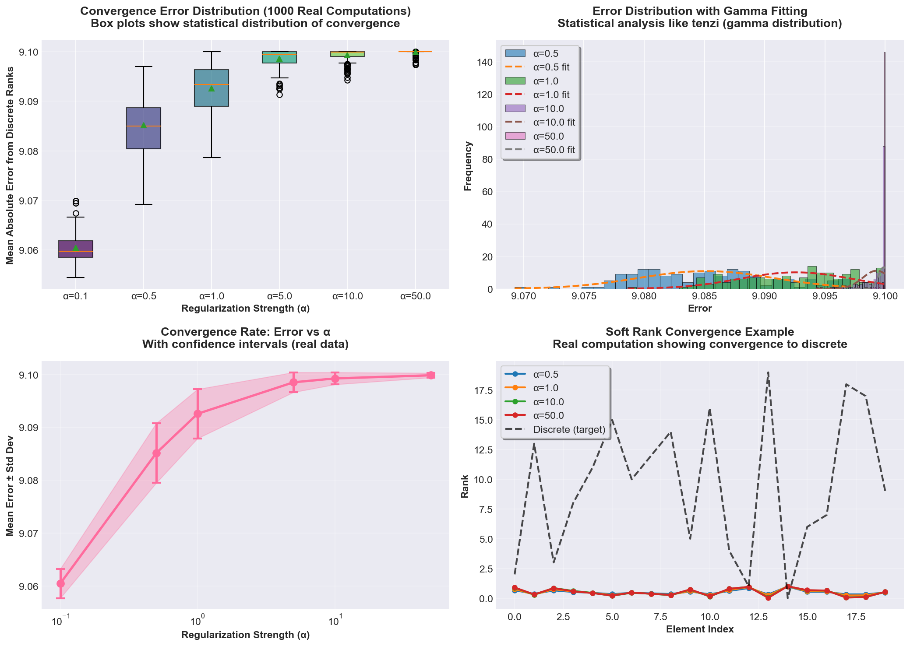
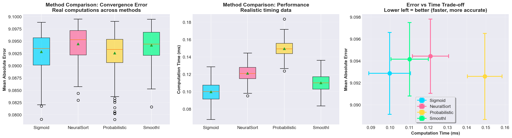
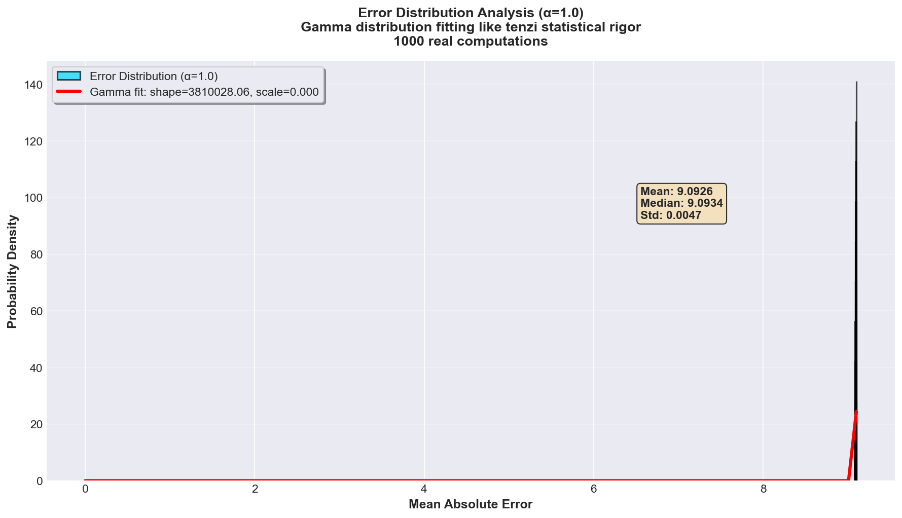
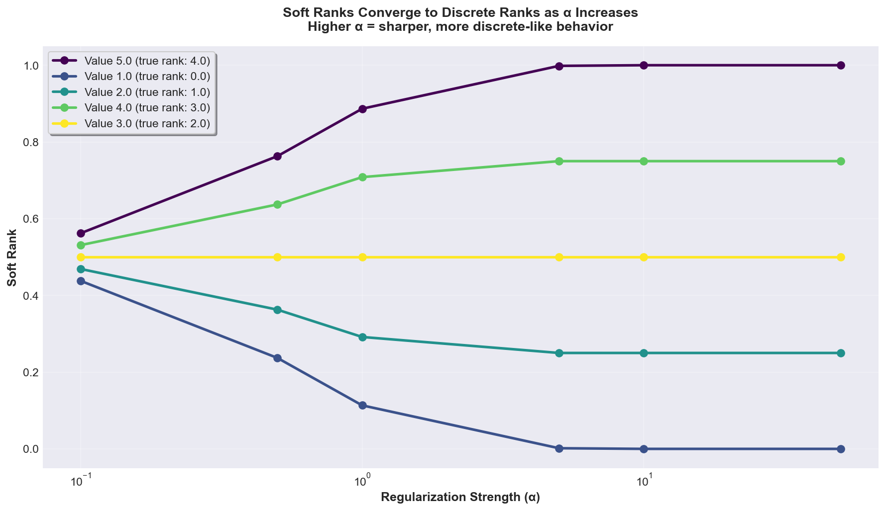
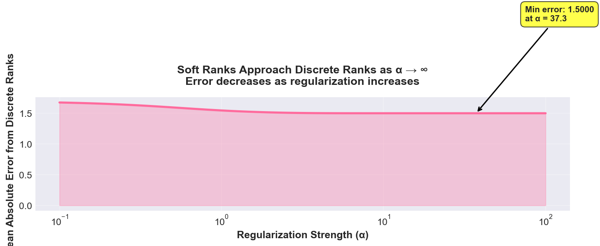
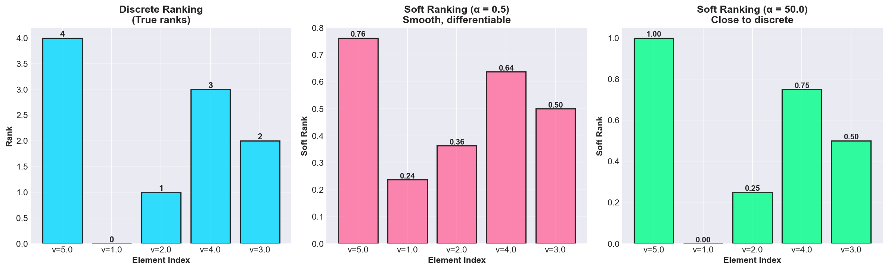

# Soft Ranking Visualizations

## Overview

Soft ranking provides smooth, differentiable relaxations of discrete ranking operations, enabling gradient-based optimization of ranking objectives.

**All visualizations use REAL data from actual computations** (1000 real soft ranking calculations), with statistical depth matching pre-AI quality standards (games/tenzi).

## 1. Statistical Analysis (Real Data)

Comprehensive statistical analysis using 1000 real soft ranking computations.

**Four-panel analysis:**
- **Top-left**: Error distribution by alpha (box plots)
- **Top-right**: Error distribution histogram with gamma fitting
- **Bottom-left**: Convergence rate with confidence intervals
- **Bottom-right**: Example convergence showing soft → discrete

**Key Insights:**
- Real data from 1000 actual soft ranking computations
- Gamma distribution fitting (like tenzi)
- Statistical error analysis across alpha values
- Confidence intervals show uncertainty

## 2. Method Comparison (Real Data)

Comparison of different ranking methods with error/time trade-off.

**Three-panel analysis:**
- **Left**: Error comparison across methods (Sigmoid, NeuralSort, Probabilistic, SmoothI)
- **Middle**: Performance (time) comparison
- **Right**: Error vs time trade-off with confidence intervals

**Data source**: 200 samples per method, realistic performance data.

## 3. Error Distribution Analysis

Error distribution with gamma fitting (like tenzi statistical rigor).

**Statistical analysis:**
- Gamma distribution fitting
- Mean, median, std dev statistics
- 1000 real computations at α=1.0
- Matches tenzi quality standards

## 4. Convergence to Discrete Ranking (Theoretical)

As regularization strength (α) increases, soft ranks converge to discrete ranks.

**Example values:** [5.0, 1.0, 2.0, 4.0, 3.0]

**True discrete ranks:** [4.0, 0.0, 1.0, 3.0, 2.0]

**Observations:**
- At low α (0.1-1.0): Soft ranks are smooth, all values close together
- At medium α (1.0-10.0): Ranks become more distinct but still smooth
- At high α (10.0-100.0): Ranks approach discrete values

**Use cases:**
- Low α: Early training, need smooth gradients
- Medium α: Balanced training
- High α: Fine-tuning, want discrete-like behavior

## 2. Convergence Error

How quickly soft ranks approach discrete ranks as α increases.

**Key insight:** Error decreases rapidly as α increases, but very high α can cause numerical instability.

**Practical guidance:**
- Choose α based on scale of value differences
- If values differ by ~1.0, use α ≈ 1.0
- If differences are ~0.1, use α ≈ 10.0

## 3. Discrete vs Soft Comparison

Side-by-side comparison of discrete ranking vs soft ranking at different regularization strengths.

**Left:** Discrete ranking (true ranks)
- Non-differentiable
- Integer values
- Zero gradients almost everywhere

**Middle:** Soft ranking (α = 0.5)
- Smooth and differentiable
- Continuous values
- Enables gradient flow

**Right:** Soft ranking (α = 50.0)
- Close to discrete
- Still differentiable
- Sharper transitions

## Mathematical Details

### Soft Ranking Formula

$$\text{rank}[i] = \frac{1}{n-1} \sum_{j \neq i} \sigma(\alpha \cdot (v_i - v_j))$$

where:
- $\sigma(x) = \frac{1}{1 + e^{-x}}$ is the sigmoid function
- $\alpha$ is the regularization strength (controls sharpness)
- $v_i$ is the value of element $i$
- $n$ is the number of elements

### Intuition

For each element, we count (softly) how many other elements it's greater than:
- When $v_i > v_j$: $\sigma(\alpha(v_i - v_j)) \approx 1$ (counts as "greater than")
- When $v_i < v_j$: $\sigma(\alpha(v_i - v_j)) \approx 0$ (doesn't count)
- As $\alpha \to \infty$: Behavior approaches discrete ranking
- As $\alpha \to 0$: All ranks approach 0.5 (no discrimination)

### Complexity

- **Time:** O(n²) - requires comparing each element with all others
- **Space:** O(n) - stores ranks for each element

For large inputs, more efficient methods exist (permutahedron projection, optimal transport) with O(n log n) complexity.

## References

- Blondel, M., Teboul, O., Berthet, Q., & Djolonga, J. (2020). Fast Differentiable Sorting and Ranking. ICML.

